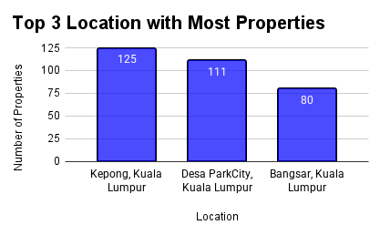
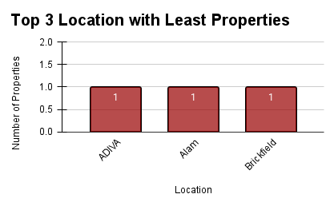
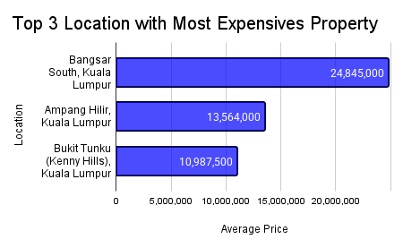

# Excel_PivotTable
📌 One of the assignment about learning data analyst in Studi Independen bootcamp by Karier.mu

📌 I was given a [dataset](./Data/dataset.csv) in Excel where I have to clean the data and also answer several given questions.

## Cleaning Data Steps :
1. Check for duplicates: Click Data → Data Cleanup → Remove Duplicates.
2. Remove the 'RM' prefix in the "Price" column so the values can be visualized properly.
3. Fill missing values in the "Price" column using the average (=AVERAGE).
4. Fill missing values in the "Bathroom" column using the mode (=MODE).
5. Fill missing values in the "Car Park" column using the mode (=MODE).
6. Remove the value "studio" from the "Rooms" column.
7. Replace values like "3+1" with 4, "3+2" with 5, etc., using Find and Replace in the "Rooms" column.
8. Remove entries like "3+", "20 above", and similar from the "Rooms" column.
9. Fill missing values in the "Rooms" column using the median (=MEDIAN).
10. Remove rows with missing values in the "Furnishing" column.
11. Remove invalid entries like "land area = -sq", "kuala lumpur -sq", and "0 sq" in the "Size" column.
12. Remove rows with missing values in the "Size" column.
13. Remove the word "built-up" in the "Size" column since the variable refers to the total property area.
14. Remove text like "land area:" and "sq ft" to make the "Size" column suitable for visualization (e.g., boxplot).
15. Replace values like "40x80" with their actual calculated area (e.g., 40×80 = 3200) in the "Size" column.

## Questions & Answers :
1. Categorize the property prices where 'Low' is below 1,163,876, 'Mid' is below 3,817,500, and anything above is 'High'.

   🔍 Add Column 'Category', then write formula | =IF(B2<1163876, "Low", IF(B2<3817500, "Mid"  , "High")) | for its value (note : B2 = 'Price' column)
2. What are the top three locations that have the highest number of properties, and the bottom three locations that have the lowest number of properties?

   🔍 Create a [Pivot Table](./Question_2/no2.csv) from [clean_data.csv](./Data/clean_data.csv)
   
   🔍 Rows = 'Location'

   🔍 Values = 'Location'

   🔍 Summarize the 'Location' values by COUNTA

   🔍 Sort the results by the count in descending/ascending order

   🔍 Use a chart to better illustrate the data.

    

3. Which furnishing status dominates in all locations?

   🔍 Create a [Pivot Table](./Question_3/no3.csv)

   🔍 Rows = 'Furnishing'

   🔍 Values = 'Furnishing'

   🔍 Summarize the 'Furnishing' values by COUNTA

   🔍 Sort the results by the count in descending order

   🔍 The answer is 'Partly Furnished'

4. What is the average land size in each location category?

   🔍 Create a [Pivot Table](./Question_4/no4.csv)

   🔍 Rows = '1.Category'

   🔍 Values = 'Size'

   🔍 Summarize the 'Size' values by AVERAGE

5. Which 3 locations have the highest average property prices?

   🔍 Create a [Pivot Table](./Question_5/no5.csv) from [clean_data.csv](./Data/clean_data.csv)
   
   🔍 Rows = 'Location'

   🔍 Values = 'Price'

   🔍 Summarize the 'Prices' values by AVERAGE

   🔍 Sort the results by the count in descending order

   🔍 Use a chart to better illustrate the data. 

